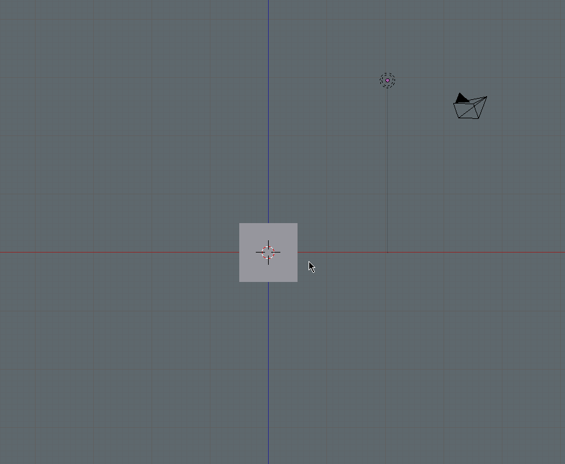
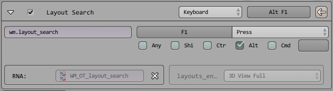

# p/layout-search
a simple blender addon for quick switching between layouts



## Installation
Put `ui_p-layout-search.py` in your addons folder.
```
<your-blender-path>/<blender-version>/scripts/addons/
```
Enable in *User Preferences > Add-ons > User Interface*
Add a key binding for `wm.layout_search` (preferably under *Screen > Screen (Global)*) and bind it to whatever you want:


